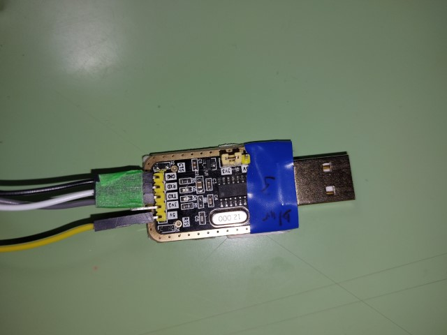
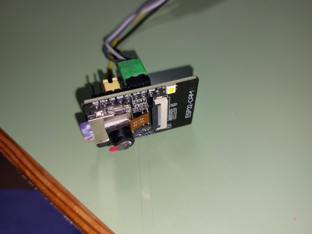
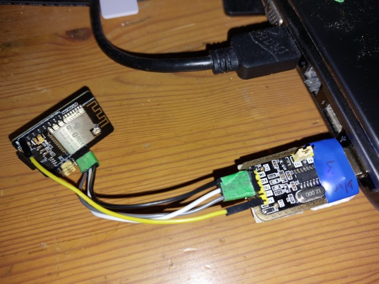
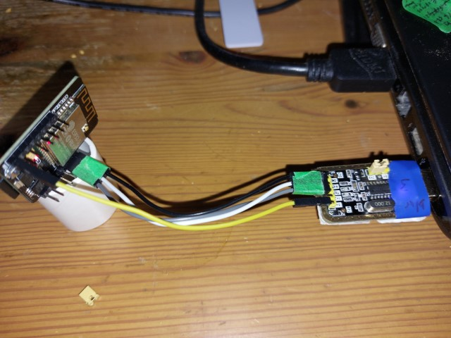

##  Lengthy Instructions to Install and Operate ESP32-CAM-VideoCam

## Goto the github.io website ... not github.com

##  Wire up the ESP32-CAM Correctly

FTDI - ESP32   
Gnd  - Gnd   
TX   - UOR   
RX   - UOT   
+5   - +5   
   
When programming, jumper gpio0 to gnd (next pin)

Nice grapics from Dronebot 
https://dronebotworkshop.com/esp32-cam-microsd/

I have slightly different FTDI module - "shorter wires = fewer brownouts"    
If you use a breadboard or long USB cable you will get brownouts on the ESP32.  
Another solution is thick wires with nice soldering, and a 100 microFarad capactor between +5 and GND on ESP32  

Make sure FTDI has jumper set to 3.3v data for the ESP32 pins

GND - RX - TX in sequence

GND - UOT - UOR in sequnce, giving us the RX-UOT flip, and jumper on GND-Gpio0

Plug in +5 to start in program mode

Unplug +5, remove GND-Gpio0 jumper, put power back, and we are running!

## Click the Connect button
 

## If this box is empty, we cannot see your ESP32 on a com port

Make sure the com port is free -- not connected to arduino console for example

 

## Click on the Correct Com port for your ESP32-CAM, and click Connect

 

## You should see this, then hit Logs and Console 

 

## You will get this black box, now power on the ESP32, and you get this Ready to Program line

There are three on them here due to awkward plugging

 

## Hit the Back Button in lower right of Black Box, and click Install ESP32-CAM-Wideo-Recorder

## And hit Install at this prompt - your ESP32 will be erased and installed

 

 

 

 

 

## Next, power off ESP32, remove the Gpio0 jumper, restart the Logs and Console, then power it on

1.  The first 6 lines are the standard boot message.
2.  The Program starts
3.  You have nothing in EPROM
4.  Mount the SD card, and you have no config.txt
5.  Create a config.txt, and display the parameters, ...

 

## Slide down the the mouse scroll wheel

1.  More prarmeters
2.  The ssid1234 is the code for no-wifi
3.  Create log file on sd, with your camera name and #1 session
4.  Set up camera
5.  Check you have 4MB of psram
6.  Start camera and print out type - ov2640 is the standard camera 
7.  Create some buffers
8.  Delete the oldest files if your sd is 80% full
9.  Start the camera and sd taks
10.  Start recording the movie
11.  It is desklens1.001.avi or camera name, session #1, movie #1

 

## Accidently unplug the +5 volt wire

1.  You will see this on the console.
2.  This console only seems to update with a blank line
3.  You will see a line every 100 frames to show you progress with some nice stats
4.  And another line on an individual frame with more stats

 

## Edit in your SSID and Password

1.  Since we screwed up the first recording, use this opportunity to pull out the sd, put it in your computer, and edit the config.txt on the sd card
2.  These are the files for the first session - the config.txt, the one movie, and the log file for the session.
3.  They have no dates because with no wifi, we do not know the date
4.  You can also add your timezone, and parameters or recording to realtime, timepalse, streaming speed, etc as described in config.txt file
5.  Make sure there are 2 spaces after the number or text, and before the // comment

 

## Now put the sd back in ESP32 and starts Logs and Console, and power up

1.  You will see these 3 screens 
2. Reboot message
3. You now have Eprom, so goto next session #2
4. Mound sd card, and get your new config and display

 

1.  Create a new log file for session #2
2.  Connect to wifi - print out the names to make sure they are correct
3.  Get the date and time
4.  Print the ip address
5.  Regisiter your name "desklens" with your router
6.  Set up camera

 

1.  Start recording desklens2.001.avi

 

##  Now look at Router to see your ESP32-CAM

This is how it looks on mine

 

## Go to a browser on computer or phone and enter the name or ip of ESP32-CAM

 

### And you get some stats

 

## If you use Windows Chrome, you might get this ... Switch to Windows Edge

There is a bugfix to allocate more cookie buffers in ESP32 core

 

## You can click the IP to update the stats, and you get his on console 

The http index line ... use this to force console to update

 

## Try the Streaming on browser, and stats on console

1.  You get cosole messages when streaming begins and ends. 
2.  The console shows it is recording at 12.5 fps (the camera max), but streaming fluxuates a little from 15 down to about 12.

 

 

## Try the 10 photos at intervals - you can save these with your browser

 

## Try the File Manager

These are your files from session #1 and #2 ... with dates

 

## Click the filename to download it to your browser computer

These mjpeg avi's are big files - not enough ram or cpu time in a ESP32 to compact them.  
The ESP32 wifi is about 3.5 Mega-bits-per-second, and in a house with your router 50 feet away, you can get 3 Mbps when you are not recording, or about 2 Mbps when recording, with the on-module antenna.  Moving outside you will get slower speeds, and may need an external antenna.

But when you pull out the sd card, and plug it into your computer, you can copy the movies at about 20 Mega-bytes-per-second, or about 80 times faster than the transfer or wifi option.  Plus if you are recording, and doing a full speed file transfer, you will really burn out your battery, and heat up the ESP32, so ... it is of modest benefit, unless your camera is remote.  The wifi is very good for configuration, looking through the viewfinder, and occasionally grabbing a short avi.  I'm working on a version to hop around inside a movie to see if there is anything worth copying to the computer, without downloading the entire thing.
 
The file will land in your default download directory -- here it is one my Windows computer

 

 

## Click the "E" beseide config.txt to edit the config file

After you save the new config, you have to click "End Movie and Reboot" for it to take effect

 

 

## Start vlc on computer, Open a Network Stream

 

## Enter the url from the Stream link on website and select Convert

 

## Select Dump Raw Output, Browse to a FileName

 

## Choose a computer file name to record the video stream, hit Save

 

## and hit Start

The recording will be a mjpeg file, which has no sense of time, it just plays the stream as fast as it can.

 

## hit the square stop button to stop streaming, and stream record

## When the sd video recording is done, you see some stats on the console, and in the log file

 

## Now unplug everything, and put sd card in computer, and here are the movies

 

## Any movie that does not end gracefully will not have an index, so vlc will show this, and it will not play at correct speed or length

 

Here you are 44 seconds into a 21 second movie, from the unplug 5v incident - the movie has no index

 

## The sd recorded movie, looks like the stream and computer recorded movie

 

 

## Questions, Comments, Like and Subscribe ...

## Other Programs in the ESP32-CAM-Video Recorder Family

https://github.com/jameszah/ESP32-CAM-Video-Recorder-junior   
- the source code for this program

https://github.com/jameszah/ESP32-CAM-Video-Recorder    
- older version, that will send photos and links to telegram.org at the end of every movie, and let you download that movie.
- has some PIR controls as well

https://github.com/jameszah/ESP32-CAM-Video-Telegram
- this will record photos or realtime/timelapse movies in memory and send the photo or movie to a telegram.org bot.
- you can use your telegram app on phone or copmputer to request a photo/movie, or have it triggered by a pir or radar module.
- No sd card required for this app, all the output is sent to telegram

## Are you still reading this?

I need a coffee!  Documentation is exhausting.

<https://ko-fi.com/jameszah>

